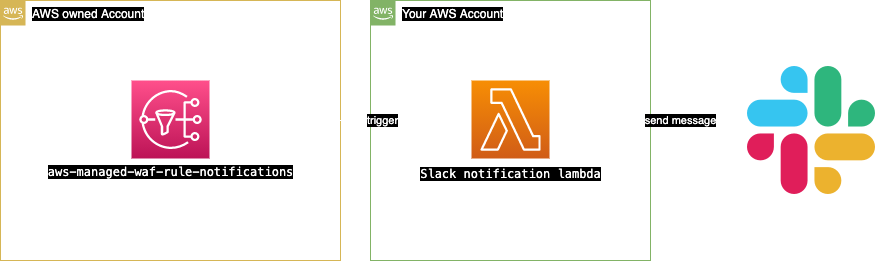
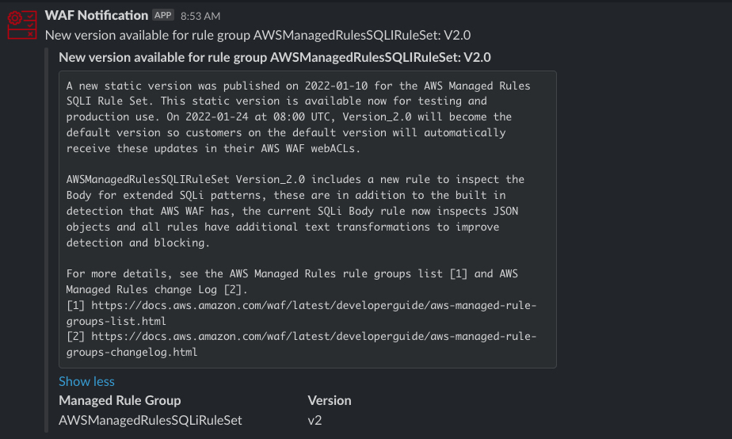

# WAF Managed Rules Slack notification

On August 9, 2021 AWS WAF released a managed rule group versioning feature.This feature is enabling you to select a specific version of a managed rule group within your web ACL, giving you the ability to test new rule updates safely and roll back to previously tested versions.
In addition, AWS WAF now provides early notifications of upcoming rule updates to your managed rule groups through Amazon Simple Notification Service (Amazon SNS). This automation will send slack notifactions of managed rule updates for a specific managed rule group.

To retrieve the Amazon SNS topic ARN for a managed rule group you need to do the following:

**Console**

- (Option) When you add the managed rule group to your web ACL, choose Edit to see the rule group's information, which includes the rule group's Amazon SNS topic ARN.

- (Option) After you've added the managed rule group into your web ACL, edit the web ACL, then select and edit the rule group rule to see the rule group's Amazon SNS topic ARN.

**API** – DescribeManagedRuleGroup

**CLI** – aws wafv2 describe-managed-rule-group --scope REGIONAL --vendor-name <vendor> --name <managedrule_name>

### Architectur:

### Example Event:

 

## Deployment

1. Follow the [documentation](https://api.slack.com/messaging/webhooks) to get a Webhook for your Slack channel

2. Upload  'MANGEDRULE.png' as custom emoji 'mangedrule' to Slack. 

3. Add your Webhook to WebhookUrl Parameters file in values/values.json

3. Deploy the solution via taskfile

